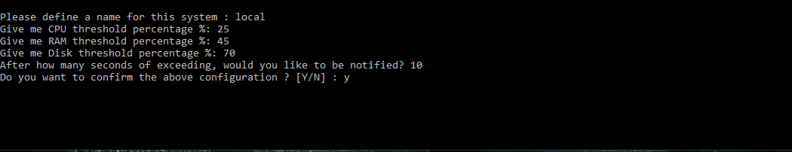
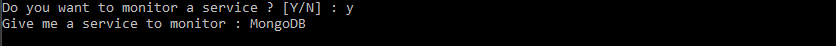

# System Monitoring Tool
It is a service which monitors the resources of your system (CPU, RAM, Disk, Windows Services).

## Why should I use this program?
This program would be very handy, if you maintain 1 or more systems and you need to perform frequent health checks.
You will configure the program as per your needs and you will be notified only when the system exceeds your given thresholds.
So, you don't have to connect to your systems each time.

## How I use this program?
Prerequisites:
-	Python3 installed in the environment that you will download the repository
-	You have a valid gmail account which is not using two-factor authentication

Steps to be followed:
Clone the repository. 
Go to the installed folder. 
Open your command prompt and execute “python os_utility.py” like the following screenshot

Then you must configure program's variables.

e.g. In the given configuration, if the server is using more than 45% of RAM resources for more than 10 seconds, the program will send a notification email like the following.

When the RAM uses less than given threshold (=45%), you will receive an email that informs that this incident was resolved.

And the health check will continue in the same way. Similar for CPU and Disk.

If you are using Windows OS, you will be able to monitor the status of a windows service.

Please ensure that you will give the valid Service Name

So, if the given service is not running, we will receive a notification email like the following.

And when it will start again you will be notified, accordingly.

Then, you must establish the gmail connection, from which the notification emails will be sent.
-	Give valid credentials
-	Verify that you are not using two-factor authentication
-	Enable less secure apps to access https://myaccount.google.com/lesssecureapps

Congratulations, the program is running!
